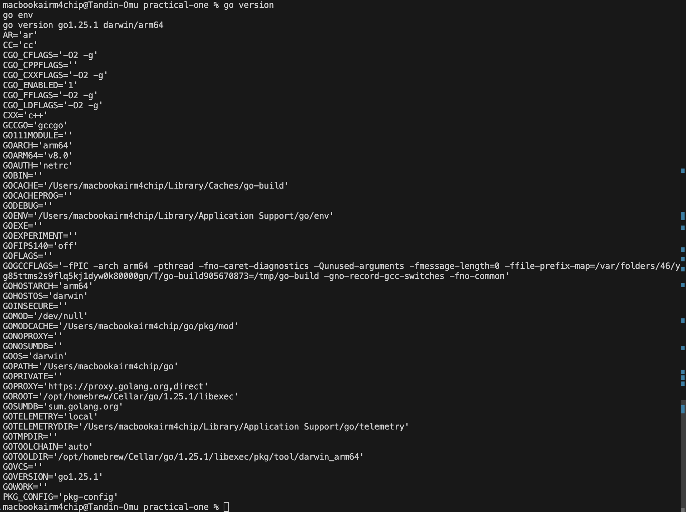
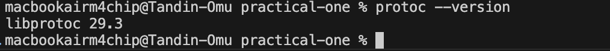
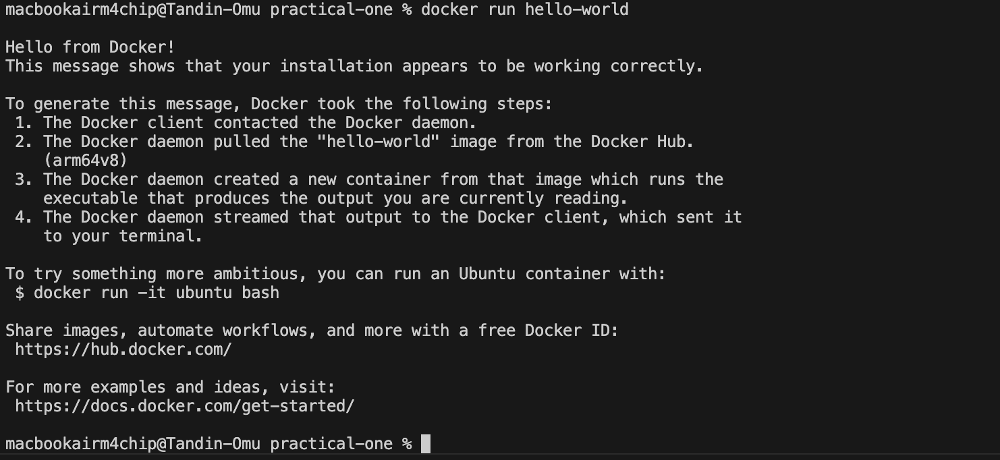
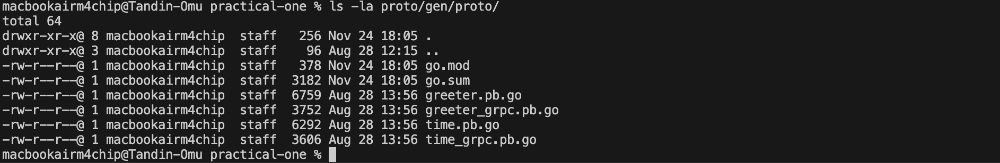
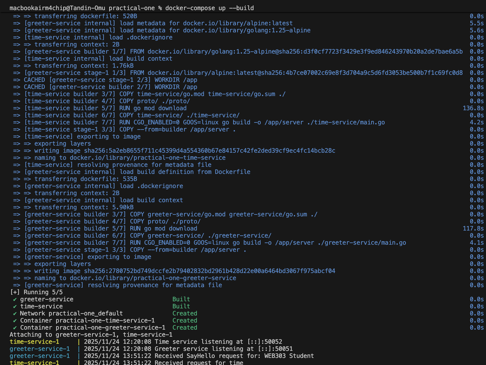
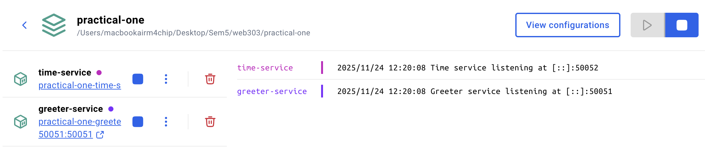
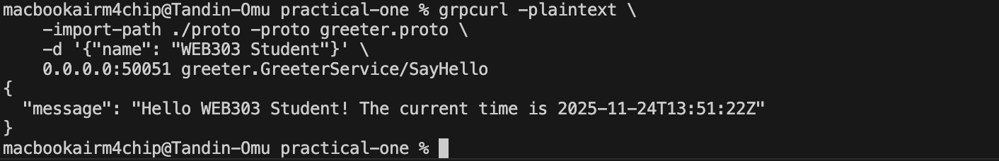
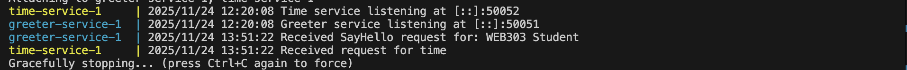

# Practical 1 Report: From Foundational Setup to Inter-Service Communication

## Introduction
 
Practical 1 is setting up a microservices development environment and building a multi-container application using Go, gRPC, Protocol Buffers, and Docker Compose.

**Learning Outcomes Addressed:**
- **LO2:** Design and implement microservices using gRPC and Protocol Buffers for efficient inter-service communication
- **LO6:** Deploy microservices using Docker Compose as a foundation for container orchestration
- **LO1:** Understand fundamental concepts of microservices architecture

---

## Part 1: Foundational Development Environment Setup

### 1.1 Installing and Configuring Go

Go was installed as the primary programming language for microservice development.

**Installation Steps:**
1. Downloaded Go from the official website (https://go.dev/dl/)
2. Installed Go on the system
3. Verified installation and environment configuration

**Verification Output:**


*Screenshot 1: Go version and environment variables verification*

**Command Used:**
```bash
go version
go env
```

**Result:** Go successfully installed and configured.

---

### 1.2 Installing Protocol Buffers & gRPC Tools

Protocol Buffers (Protobuf) was installed to enable language-agnostic data serialization and service contract definitions.

**Installation Steps:**
1. Installed the Protocol Buffers compiler (`protoc`)
2. Installed Go plugins for code generation:
   - `protoc-gen-go` for message generation
   - `protoc-gen-go-grpc` for service generation

**Verification Output:**


*Screenshot 2: Protocol Buffers compiler version verification*

**Command Used:**
```bash
protoc --version
```

**Result:** Protocol Buffers and gRPC tools successfully installed.

---

### 1.3 Installing and Verifying Docker

Docker Desktop was installed to enable containerization of microservices.

**Installation Steps:**
1. Downloaded and installed Docker Desktop
2. Started Docker Desktop application
3. Verified Docker installation with hello-world container

**Verification Output:**


*Screenshot 3: Docker hello-world test output*

**Command Used:**
```bash
docker run hello-world
```

**Result:**  Docker successfully installed and running.

---

## Part 2: Building and Orchestrating Communicating Microservices

### 2.2 Protocol Buffer Definitions

**Time Service Contract (`proto/time.proto`):**
- Defines a `TimeService` with a `GetTime` RPC method
- Returns the current server time in RFC3339 format

**Greeter Service Contract (`proto/greeter.proto`):**
- Defines a `GreeterService` with a `SayHello` RPC method
- Accepts a name parameter and returns a personalized greeting

**Generated Go Code:**


*Screenshot 5: Generated .go files from proto definitions*

**Command Used:**
```bash
protoc --go_out=./proto/gen --go_opt=paths=source_relative \
    --go-grpc_out=./proto/gen --go-grpc_opt=paths=source_relative \
    proto/*.proto
```

**Generated Files:**
- `greeter.pb.go` - Message definitions for Greeter service
- `greeter_grpc.pb.go` - gRPC service definitions for Greeter
- `time.pb.go` - Message definitions for Time service  
- `time_grpc.pb.go` - gRPC service definitions for Time

**Result:** Service contracts defined and Go code successfully generated.

---

### 2.3 Service Implementation

#### Time Service Implementation

The Time Service acts as a gRPC server that:
- Listens on port 50052
- Implements the `GetTime` RPC method
- Returns the current server time in RFC3339 format

**Key Implementation Details:**
```go
func (s *server) GetTime(ctx context.Context, in *pb.TimeRequest) (*pb.TimeResponse, error) {
    currentTime := time.Now().Format(time.RFC3339)
    return &pb.TimeResponse{CurrentTime: currentTime}, nil
}
```

---

#### Greeter Service Implementation

The Greeter Service acts as both a gRPC server and client:
- Listens on port 50051 (server)
- Connects to Time Service on port 50052 (client)
- Implements the `SayHello` RPC method
- Fetches current time from Time Service and includes it in the greeting

**Key Implementation Details:**
```go
func (s *server) SayHello(ctx context.Context, in *pb.HelloRequest) (*pb.HelloResponse, error) {
    timeRes, err := s.timeClient.GetTime(ctx, timeReq)
    message := fmt.Sprintf("Hello %s! The current time is %s", 
                          in.GetName(), timeRes.GetCurrentTime())
    return &pb.HelloResponse{Message: message}, nil
}
```

**Result:** Both services implemented with inter-service communication.

---

### 2.4 Containerization with Docker

Both services were containerized using multi-stage Docker builds:

**Dockerfile Strategy:**
1. **Stage 1 (Builder):** Compile Go application in golang:alpine image
2. **Stage 2 (Runtime):** Copy binary to minimal alpine:latest image

**Benefits:**
- Reduced final image size
- Improved security (minimal attack surface)
- Faster deployment

**Result:**  Both services successfully containerized.

---

### 2.5 Orchestration with Docker Compose

Docker Compose was configured to manage both services as a single application.

**docker-compose.yml Configuration:**
```yaml
services:
  time-service:
    build:
      context: .
      dockerfile: time-service/Dockerfile
    hostname: time-service

  greeter-service:
    build:
      context: .
      dockerfile: greeter-service/Dockerfile
    hostname: greeter-service
    ports:
      - "50051:50051"
    depends_on:
      - time-service
```

**Key Features:**
- **Service Discovery:** Services communicate using hostnames (e.g., `time-service:50052`)
- **Dependency Management:** `greeter-service` waits for `time-service` to start
- **Network Isolation:** Both services run on a shared Docker network
- **Port Mapping:** Only `greeter-service` exposes port 50051 to the host

---

### 2.6 Building and Running the Application

**Build Process:**


*Screenshot 6: Docker Compose build process*

**Command Used:**
```bash
docker-compose up --build
```

**Build Output:**
- Both Docker images built successfully
- Services started in correct dependency order
- Both services listening on their respective ports

---

**Running Services:**


*Screenshot 7: Both services running and showing logs*

**Observed Behavior:**
- Time Service: Listening on port 50052
- Greeter Service: Connected to Time Service and listening on port 50051
- Both services logging startup messages

**Result:**  Application successfully built and running.

---

### 2.7 Testing Inter-Service Communication

The final test verified that:
1. The Greeter Service can receive external gRPC requests
2. The Greeter Service can successfully call the Time Service
3. Both services communicate over the Docker network
4. The response includes data from both services

**Test Command:**
```bash
grpcurl -plaintext \
    -import-path ./proto -proto greeter.proto \
    -d '{"name": "WEB303 Student"}' \
    0.0.0.0:50051 greeter.GreeterService/SayHello
```

**Test Results:**


*Screenshot 8: Final grpcurl test showing successful response*

**Expected Response:**
```json
{
  "message": "Hello WEB303 Student! The current time is 2025-11-24T12:45:30Z"
}
```


*Screenshot 9: Docker Compose logs showing inter-service communication*

**Log Analysis:**
- Greeter Service received the SayHello request
- Greeter Service called Time Service's GetTime method
- Time Service processed the request and returned current time
- Greeter Service composed the final response with time information

**Result:** Inter-service communication working correctly.


## Challenges Encountered


### Challenge 1: Proto File Path Configuration
**Issue:** Generated proto files were nested in `proto/gen/proto/` instead of `proto/gen/`

**Solution:** Verified the `go_package` option in .proto files matched the expected path structure.

**Learning:** The `go_package` option in proto files determines the output path structure.


### Challenge 2: Service Discovery in Docker Network
**Issue:** Understanding how `greeter-service` could connect to `time-service:50052` without explicit IP configuration.

**Solution:** Docker Compose creates a default network where service names act as DNS hostnames.

**Learning:** Docker Compose automatically provides service discovery through DNS resolution of service names.

---

## Conclusion

This practical successfully demonstrated the complete workflow of building, containerizing, and orchestrating microservices:

**Key Achievements:**
1.  Development environment fully configured with Go, Protocol Buffers, and Docker
2.  Two microservices implemented with gRPC for efficient communication
3.  Protocol Buffers used for language-agnostic service contracts
4.  Services containerized using Docker multi-stage builds
5.  Application orchestrated using Docker Compose
6.  Inter-service communication verified through testing

**Technical Skills Gained:**
- gRPC service implementation in Go
- Protocol Buffer schema definition and code generation
- Docker containerization and multi-stage builds
- Docker Compose orchestration
- Service discovery in containerized environments
- Testing gRPC services with grpcurl

**Architecture Understanding:**
- Microservices communicate over network protocols (gRPC)
- Services are loosely coupled through well-defined contracts
- Container orchestration simplifies deployment and management
- Service discovery enables dynamic communication between services


