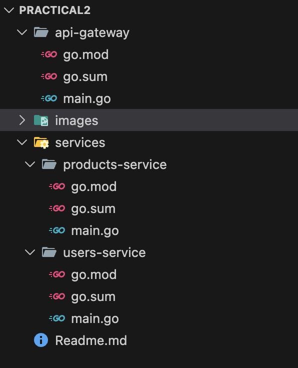
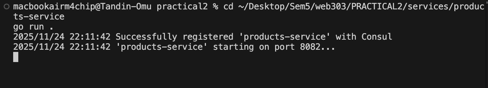
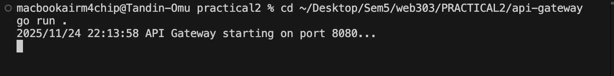
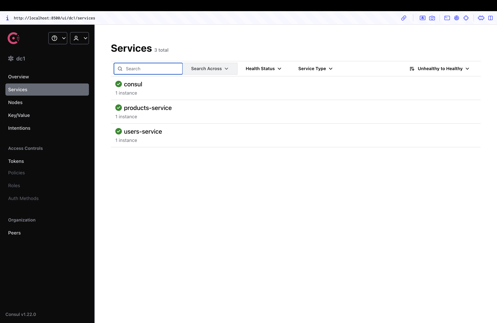
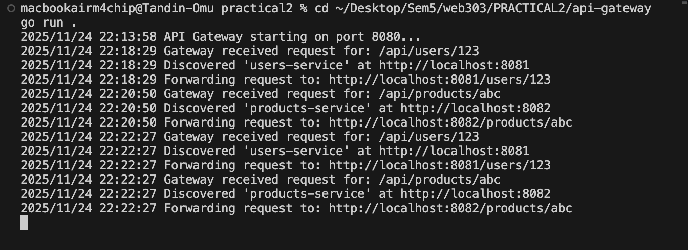
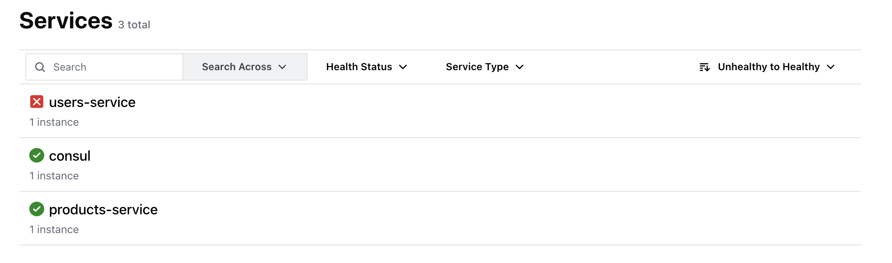
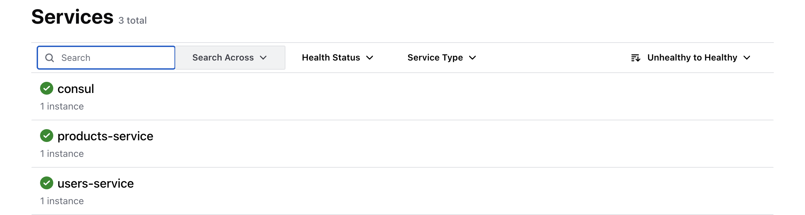

# Practical 2 Report: API Gateway with Service Discovery

---

## Introduction

This practical demonstrates the implementation of an API Gateway pattern with dynamic service discovery using HashiCorp Consul. The system consists of two independent microservices that register themselves with a central service registry, and an API Gateway that dynamically routes requests to the appropriate healthy service instances.

**Learning Outcomes:**
- Design and implement microservices with efficient inter-service communication
- Implement observability solutions including service health monitoring
- Understand service discovery and dynamic routing patterns

---

## Architecture Overview

The microservices ecosystem consists of four components working together:

**1. Consul (Service Registry)**  
Acts as a centralized "phone book" that maintains a registry of all available services and their health status. Services register themselves on startup and Consul continuously monitors their health.

**2. Users Service (Port 8081)**  
An independent microservice that handles user-related requests at the `/users/{id}` endpoint. It registers itself with Consul and provides a health check endpoint.

**3. Products Service (Port 8082)**  
An independent microservice that handles product-related requests at the `/products/{id}` endpoint. Like the users service, it self-registers with Consul.

**4. API Gateway (Port 8080)**  
A smart reverse proxy that serves as the single entry point for all client requests. It queries Consul to discover healthy service instances and dynamically routes requests.

**Request Flow:**
```
Client → API Gateway (Port 8080) → Consul (Service Discovery) → Target Service
                                                                 ↓
                                         Users Service (8081) or Products Service (8082)
```

---

## Implementation

### Project Structure

The project follows a clean separation of concerns with independent service modules:


*Project folder structure showing api-gateway and services directories*

---

### Service Implementation

**Users Service (`services/users-service/main.go`)**

The users service implements three key functions:

1. **Service Registration:** On startup, registers itself with Consul including service name, port, address, and health check configuration
2. **HTTP Endpoints:** Provides `/users/{id}` for business logic and `/health` for health checks
3. **Request Handling:** Returns user information based on the ID parameter

Key configuration:
- Service Name: `users-service`
- Port: 8081
- Health Check: HTTP GET to `/health` every 10 seconds

---

**Products Service (`services/products-service/main.go`)**

The products service follows the same pattern as the users service with different endpoints:

- Service Name: `products-service`
- Port: 8082
- Endpoint: `/products/{id}`
- Health Check: HTTP GET to `/health` every 10 seconds

This demonstrates the repeatability of the service registration pattern - each service is independent but follows the same architectural principles.

---

**API Gateway (`api-gateway/main.go`)**

The gateway implements dynamic routing logic:

1. **Request Parsing:** Extracts service name from URL path (e.g., `/api/users/123` → `users-service`)
2. **Service Discovery:** Queries Consul's health API for healthy instances of the target service
3. **Path Rewriting:** Transforms external URLs to internal service URLs
4. **Request Forwarding:** Acts as a reverse proxy to forward requests to discovered services

Routing rules:
- `/api/users/*` → `users-service` at `http://localhost:8081`
- `/api/products/*` → `products-service` at `http://localhost:8082`

---

### Consul Setup

For this implementation, I chose **Option 1: Local Consul Installation** to avoid Docker networking complexity.

**Installation and Startup:**
```bash
# Install Consul locally (macOS)
brew install consul

# Start Consul in development mode
consul agent -dev
```

**Configuration:**
- Web UI: http://localhost:8500
- Development mode: Single-node, in-memory storage
- Health checks enabled automatically

---

## Testing and Results

### Starting the Services

**Step 1: Start Consul**

Consul was started in development mode in a dedicated terminal:

```bash
consul agent -dev
```

Initial Consul UI showed one healthy node with no registered services.

---

**Step 2: Start Users Service**

```bash
cd services/users-service
go run .
```

**Output:**
```
Successfully registered 'users-service' with Consul
'users-service' starting on port 8081...
```


*Users service startup logs*

---

**Step 3: Start Products Service**

```bash
cd services/products-service
go run .
```

**Output:**
```
Successfully registered 'products-service' with Consul
'products-service' starting on port 8082...
```


*Products service startup logs*

---

**Step 4: Start API Gateway**

```bash
cd api-gateway
go run .
```

**Output:**
```
API Gateway starting on port 8080...
```


*API Gateway startup logs*

---

### Consul UI Verification

After all services started, the Consul web UI displayed both services registered and healthy.


*Consul UI showing both services registered with green health checks* 

**Verification Points:**
- `users-service` registered with passing health check
- `products-service` registered with passing health check
- Both services showing green status indicators
- Health checks running at 10-second intervals

---

### End-to-End Testing

**Test 1: Users Service Request**

```bash
curl http://localhost:8080/api/users/123
```

**Response:**
```
Response from 'users-service': Details for user 123
```


*cURL request and response for users service* 

---

**Test 2: Products Service Request**

```bash
curl http://localhost:8080/api/products/abc
```

**Response:**
```
Response from 'products-service': Details for product abc
```


*cURL request and response for products service* 


### API Gateway Logs

The gateway terminal displayed detailed logs showing the complete request flow.


*API Gateway terminal showing request routing to both services* 


These logs demonstrate:
1. Gateway received the request
2. Service discovery succeeded via Consul
3. Request was forwarded to the correct service
4. Response was returned to the client

---

## Resilience Testing

### Demonstrating Self-Healing Architecture

This section proves that the system can handle service failures gracefully and recover automatically.

**Test Scenario: Service Failure and Recovery**

---

**Step 1: Stop Users Service**


*Consul UI showing users-service in critical/failing state*

**Observed Behavior:**
- Users service health check changed from "passing" to "critical"
- Status indicator changed from green to red
- Products service remained healthy (fault isolation)


*cURL response when service is unavailable*

**Gateway Behavior:**
- Gateway queried Consul for users-service
- Consul reported zero healthy instances
- Gateway returned appropriate error message
- No crash or cascading failure

---

**Step 2: Verify Other Services Still Work**

While users service was down, I verified products service continued operating:

```bash
curl http://localhost:8080/api/products/abc
```

**Response:**
```
Response from 'products-service': Details for product abc
```

**Result:** Products service completely unaffected by users service failure, demonstrating proper fault isolation.

---

**Step 4: Restart Users Service**

I restarted the users service in its terminal:

```bash
cd services/users-service
go run .
```

The service automatically re-registered with Consul, and health checks began passing within seconds.


*Consul UI showing users-service recovered and healthy again*

---

**Step 5: Verify Automatic Recovery**

```bash
curl http://localhost:8080/api/users/123
```

**Response:**
```
Response from 'users-service': Details for user 123
```

The service was immediately available again through the gateway with no configuration changes required.

---

### Resilience Summary

**What This Demonstrates:**

1. **Automatic Failure Detection:** Consul's health checks identified the failed service within 10 seconds
2. **Graceful Degradation:** Gateway handled the failure appropriately without crashing
3. **Fault Isolation:** One service failure did not affect other services
4. **Zero Configuration Recovery:** Service automatically re-registered on restart
5. **No Manual Intervention:** No need to restart gateway or update configurations

This architecture pattern enables:
- Services to be independently deployed and restarted
- System to handle partial failures gracefully
- Operations teams to perform maintenance without system-wide downtime
- Automatic scaling and load balancing (with multiple instances)

---

## Challenges Encountered

### Challenge 1: Docker vs Host Networking

**Issue:** Initially ran Consul in Docker while services ran on the host machine. Services registered with Consul using localhost addresses, but the gateway couldn't reach them because Docker and host have separate network namespaces.

**Root Cause:** When services register with Consul in Docker, they use addresses like `localhost:8081`, but "localhost" inside a Docker container refers to the container itself, not the host machine.

**Solution:** Chose Option 1 from the practical instructions - installed Consul locally on the host machine using Homebrew. This ensured all components (Consul, both services, and gateway) operated on the same network.

**Alternative:** Could have used Option 2 (Docker Compose) to containerize all services, ensuring they share the same Docker network.

**Learning:** Understanding network boundaries is critical in microservices. For production, all services should run in the same network environment (all containers or all host, not mixed).

---

### Challenge 2: Understanding Service Discovery Flow

**Issue:** Initially unclear how the gateway could dynamically find services without hardcoded addresses.

**Resolution:** Through implementation, understood the complete flow:
1. Services register their address and port with Consul on startup
2. Consul stores this in its service catalog
3. Gateway queries Consul's health API for service name
4. Consul returns addresses of only healthy instances
5. Gateway creates a reverse proxy to forward the request

**Key Insight:** The gateway never needs to know service addresses in advance. It asks Consul every time, ensuring it always routes to healthy, available services.

---

### Challenge 3: Health Check Configuration

**Issue:** Services initially appeared in Consul but health checks were failing even though services were running.

**Cause:** Health check endpoint misconfiguration - the check was trying to reach a non-existent endpoint.

**Solution:** Ensured each service implemented the `/health` endpoint that simply returns HTTP 200 status. Consul configuration matched this endpoint exactly.

**Learning:** Health checks are critical for service discovery. Without passing health checks, services won't be routed to even if they're technically running.

---

## Conclusion

This practical successfully demonstrated the implementation of a microservices architecture using the API Gateway and Service Discovery patterns. The system consists of two independent services that self-register with Consul, and an intelligent gateway that dynamically routes requests to healthy service instances.

 


