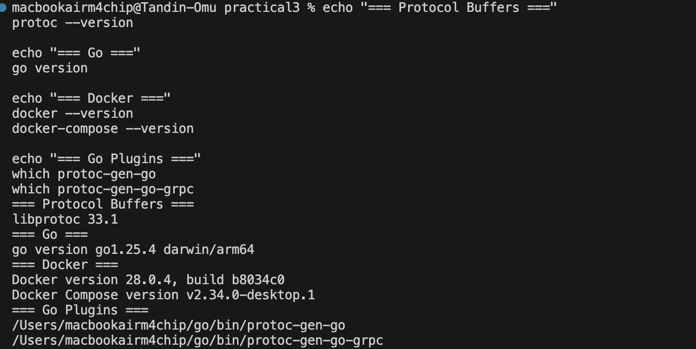
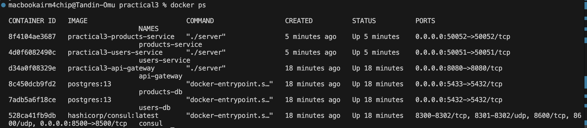
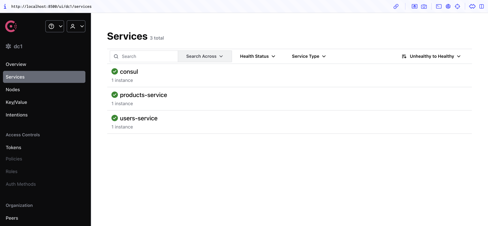
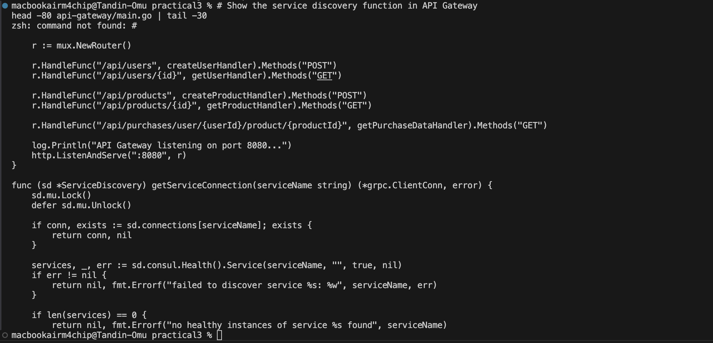

# Practical 3 Report: Full-Stack Microservices with gRPC, Databases, and Service Discovery

## 1. Introduction

This practical demonstrates a microservices architecture using gRPC, Consul service discovery, and Docker. The system includes:
- API Gateway (HTTP to gRPC)
- Users Service with PostgreSQL
- Products Service with PostgreSQL
- Consul for service discoverydocker logs api-gateway | grep "Connected to"

**Architecture:**
```
Client → API Gateway → Users/Products Services → Databases
                    ↓
                  Consul
```

## 2. Prerequisites Installation

### Install Required Tools




## 3. Project Setup

### Create Directory Structure
```bash
mkdir practical-three && cd practical-three
mkdir -p proto/gen api-gateway services/{users-service,products-service} scripts
```

## 4. Protocol Buffers Definition


## 5. Docker Configuration

### Docker Compose (`docker-compose.yml`)
```yaml
services:
  consul:
    image: hashicorp/consul:latest
    ports: ["8500:8500"]
    command: "agent -dev -client=0.0.0.0 -ui"
    networks: [microservices]

  users-db:
    image: postgres:13
    environment:
      POSTGRES_USER: user
      POSTGRES_PASSWORD: password
      POSTGRES_DB: users_db
    ports: ["5432:5432"]
    networks: [microservices]

  products-db:
    image: postgres:13
    environment:
      POSTGRES_USER: user
      POSTGRES_PASSWORD: password
      POSTGRES_DB: products_db
    ports: ["5433:5432"]
    networks: [microservices]

  users-service:
    build: ./services/users-service
    ports: ["50051:50051"]
    depends_on: [consul, users-db]
    environment: [CONSUL_HTTP_ADDR=consul:8500]
    networks: [microservices]

  products-service:
    build: ./services/products-service
    ports: ["50052:50052"]
    depends_on: [consul, products-db]
    environment: [CONSUL_HTTP_ADDR=consul:8500]
    networks: [microservices]

  api-gateway:
    build: ./api-gateway
    ports: ["8080:8080"]
    depends_on: [consul, users-service, products-service]
    environment: [CONSUL_HTTP_ADDR=consul:8500]
    networks: [microservices]

volumes:
  users_data:
  products_data:

networks:
  microservices:
    driver: bridge
```


## 6. Service Implementation

### Users Service Structure
- Database connection with GORM
- gRPC server on port 50051
- Consul registration
- CRUD operations

### Products Service Structure
Similar to Users Service but on port 50052

### API Gateway Structure
- HTTP to gRPC translation
- Consul service discovery
- Request routing
- Composite endpoints

**Note:** Full service code is provided in the assignment document. Each service follows the same pattern:
1. Database connection with retry logic
2. gRPC server setup
3. Consul registration
4. CRUD operation handlers


## 7. Build and Deployment


### Verify Running Containers




## 8. Testing

### Consul Service Discovery
Open browser: `http://localhost:8500`



### Database Verification


### API Tests

#### Test 1: Create User
```bash
curl -X POST -H "Content-Type: application/json" \
     -d '{"name": "John Doe", "email": "john@example.com"}' \
     http://localhost:8080/api/users
```


#### Test 2: Create Product
```bash
curl -X POST -H "Content-Type: application/json" \
     -d '{"name": "Laptop", "price": 1299.99}' \
     http://localhost:8080/api/products
```


#### Test 3: Get User
```bash
curl http://localhost:8080/api/users/1
```

#### Test 4: Get Product
```bash
curl http://localhost:8080/api/products/1
```

#### Test 5: Composite Endpoint (Key Feature)
```bash
curl http://localhost:8080/api/purchases/user/1/product/1
```


Expected response:
```json
{
  "user": {
    "id": "1",
    "name": "John Doe",
    "email": "john@example.com"
  },
  "product": {
    "id": "1",
    "name": "Laptop",
    "price": 1299.99
  }
}
```

### Error Handling Tests

#### Test 6: Non-existent User
```bash
curl http://localhost:8080/api/users/999
```


### Service Logs
```bash
docker logs api-gateway | grep "Connected to"
```


## 9. Key Issues and Solutions

### Issue 1: Proto File Build Problems
**Problem:** Proto files in root directory cause Docker build issues.

**Solution:** Copy proto files to each service's build context before building.

```bash
# In build.sh
for service in api-gateway services/users-service services/products-service; do
    mkdir -p "$service/proto/gen"
    cp -r proto/* "$service/proto/"
done
```

### Issue 2: Hardcoded Service Connections
**Problem:** Original implementation didn't use Consul for service discovery.

**Solution:** Implemented ServiceDiscovery struct that queries Consul:
```go
func (sd *ServiceDiscovery) getServiceConnection(serviceName string) (*grpc.ClientConn, error) {
    services, _, err := sd.consul.Health().Service(serviceName, "", true, nil)
    if len(services) == 0 {
        return nil, fmt.Errorf("no healthy instances found")
    }
    service := services[0].Service
    address := fmt.Sprintf("%s:%d", service.Address, service.Port)
    conn, err := grpc.Dial(address, grpc.WithTransportCredentials(insecure.NewCredentials()))
    return conn, err
}
```



### Issue 3: Composite Endpoint Implementation
**Problem:** No proper data aggregation from multiple services.

**Solution:** Implemented parallel gRPC calls using goroutines:
```go
var wg sync.WaitGroup
wg.Add(2)

go func() {
    defer wg.Done()
    // Fetch user data
}()

go func() {
    defer wg.Done()
    // Fetch product data
}()

wg.Wait()
// Return aggregated data
```

This reduces latency by calling both services simultaneously instead of sequentially.

## 10. Conclusion

### Achievements
 Dynamic service discovery with Consul  
 gRPC inter-service communication  
 Database isolation per service  
 API Gateway pattern implementation  
 Parallel composite endpoint calls  
 Proper error handling  

### Key Learnings
1. **Service discovery** eliminates hardcoded dependencies and enables scalability
2. **Proto file organization** is critical for multi-service Docker builds
3. **Parallel service calls** reduce latency significantly
4. **Docker networking** requires proper configuration for service communication
5. **Retry logic** is essential for handling database connection timing issues


