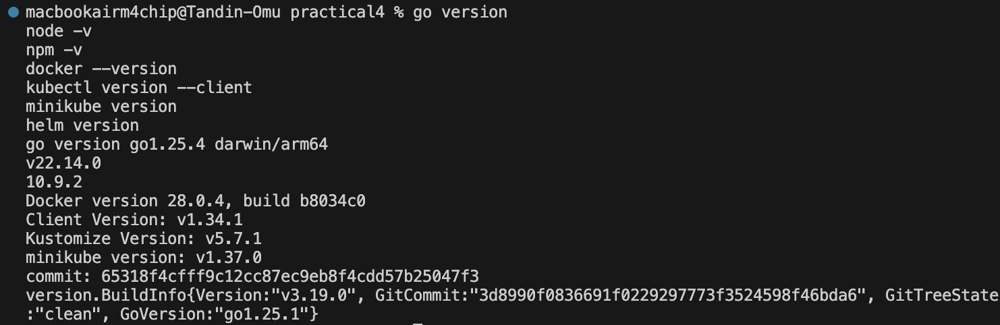
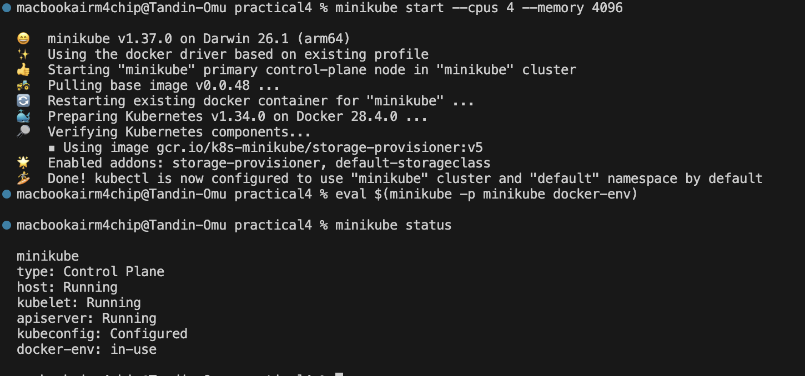
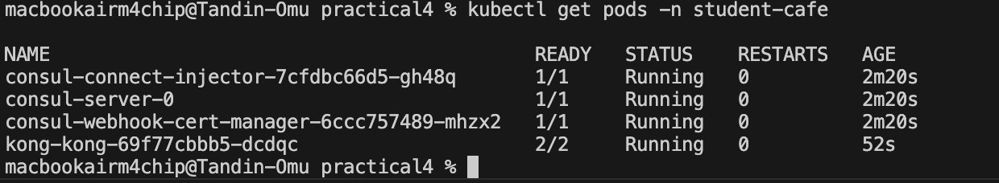
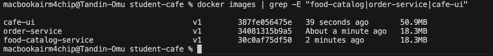
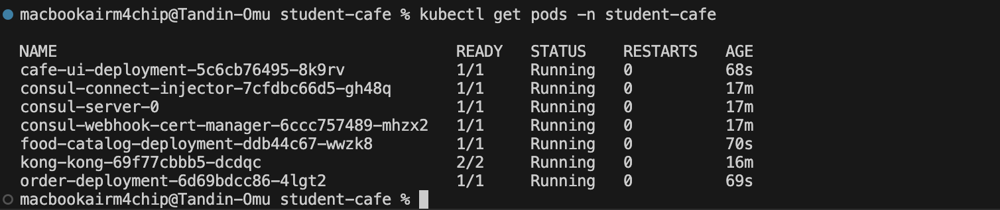
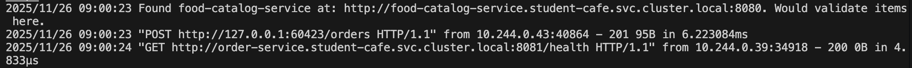
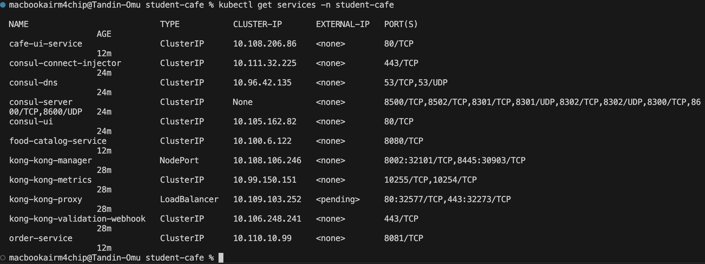
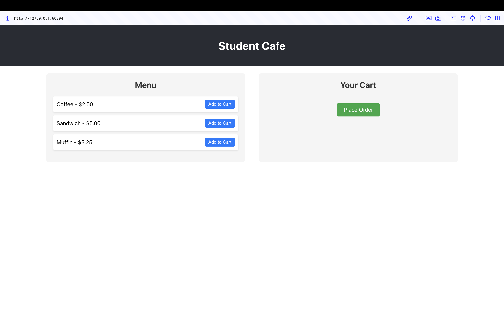
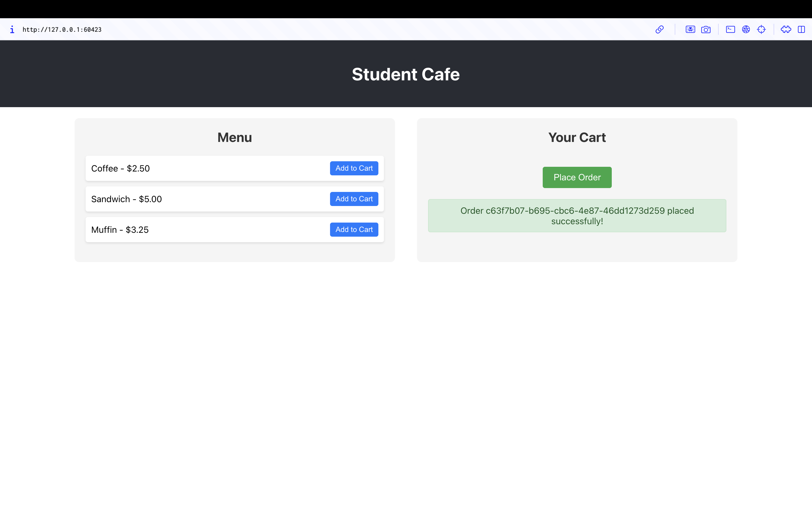
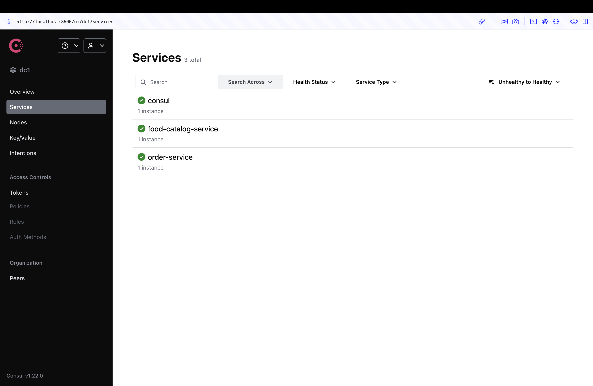

# WEB303 Practical 4 Report
## Kubernetes Microservices with Kong Gateway & Resilience Patterns

---

## Executive Summary

This practical involves deploying a microservices-based student cafe ordering system using modern cloud-native technologies. The application consists of a React frontend, two Go-based microservices (food-catalog-service and order-service), Kong API Gateway for routing, and Consul for service discovery, all orchestrated using Kubernetes.

### Learning Objectives Achieved:
- Multi-service application deployment with Kubernetes
- API Gateway configuration with Kong
- Service discovery implementation using Consul
- Container orchestration and management
- Debugging distributed systems

---

## Architecture Overview

### System Architecture Diagram

```
┌─────────────────┐
│   Student       │
│   Browser       │
└────────┬────────┘
         │
         ▼
┌─────────────────┐
│  Kong Gateway   │  (Entry Point - Port 80/443)
│  API Routing    │
└────────┬────────┘
         │
    ┌────┴────┐
    │         │
    ▼         ▼
┌─────────┐ ┌──────────────┐
│ React   │ │   Backend    │
│Frontend │ │  Services    │
└─────────┘ └──────┬───────┘
                   │
         ┌─────────┴─────────┐
         │                   │
         ▼                   ▼
    ┌────────────┐      ┌─────────────┐
    │   Food     │      │   Order     │
    │  Catalog   │◄─────┤   Service   │
    │  Service   │      │             │
    └─────┬──────┘      └──────┬──────┘
          │                    │
          │    ┌───────────┐   │
          └───►│  Consul   │◄──┘
               │  Service  │
               │ Discovery │
               └───────────┘
```

### Component Descriptions:

1. **Kong API Gateway:** Single entry point for all external traffic, routes requests to appropriate services
2. **Consul:** Service discovery platform enabling dynamic service location
3. **Food Catalog Service (Port 8080):** Manages available food items and menu
4. **Order Service (Port 8081):** Handles order creation and management
5. **React Frontend (Port 80):** User interface for browsing and ordering

---

## Prerequisites Verification

### System Requirements Check



---

## Implementation Steps

### Step 1: Starting Minikube Cluster

Initialize the local Kubernetes cluster with appropriate resources:



---

### Step 2: Creating Kubernetes Namespace

Created a dedicated namespace for the application:

```bash
kubectl create namespace student-cafe
```

This namespace isolation ensures our resources are organized and don't conflict with other applications.

---

### Step 3: Deploying Infrastructure Services

#### 3.1 Consul Deployment

Deployed Consul for service discovery using Helm.

#### 3.2 Kong API Gateway Deployment

Deployed Kong for API gateway functionality.



---

### Step 4: Building Docker Images

Built Docker images for all three application components using Minikube's Docker daemon:

```bash
# Build Food Catalog Service
docker build -t food-catalog-service:v1 ./food-catalog-service

# Build Order Service
docker build -t order-service:v1 ./order-service

# Build React Frontend
docker build -t cafe-ui:v1 ./cafe-ui
```

**Key Points:**
- Used multi-stage Dockerfile builds for optimized image sizes
- Go services built with `CGO_ENABLED=0` for static binaries
- Alpine Linux base images for minimal footprint
- React app served using Nginx



---

### Step 5: Deploying Application Services

Applied Kubernetes deployment manifests:

```bash
# Deploy all application services
kubectl apply -f app-deployment.yaml

# Verify deployments
kubectl get deployments -n student-cafe
kubectl get pods -n student-cafe
kubectl get services -n student-cafe
```

The `app-deployment.yaml` file contains:
- Deployments for all three services
- Kubernetes Services for internal networking
- Environment variables for Consul connection
- Health check configurations




---

### Step 6: Configuring Kong Ingress

Applied Kong ingress rules to route external traffic:

```bash
kubectl apply -f kong-ingress.yaml
```

**Routing Configuration:**
- `/api/catalog/*` → food-catalog-service:8080
- `/api/orders/*` → order-service:8081
- `/*` → cafe-ui-service:80


---

### Step 7: Accessing the Application

Retrieved the Kong proxy URL to access the application:

```bash
minikube service -n student-cafe kong-kong-proxy --url
```

This command outputs the external URL for accessing the application through Kong.

---

## Debugging Process

### Initial Problem: Order Submission Failure

Upon deploying the application, the order submission functionality did not work as expected. The following systematic debugging approach was used:

#### Step 1: Verify Pod Status

```bash
kubectl get pods -n student-cafe
```

**Observation:** All pods were running, indicating no deployment issues.

#### Step 2: Check Service Endpoints

```bash
kubectl get endpoints -n student-cafe
```

**Purpose:** Verify that Kubernetes services correctly mapped to pod IPs.

#### Step 3: Examine Ingress Configuration

```bash
kubectl describe ingress cafe-ingress -n student-cafe
```

**Checked:** Path routing rules, backend services, and annotations.

#### Step 4: Monitor Service Logs

```bash
# Order Service logs
kubectl logs -f deployment/order-deployment -n student-cafe

# Food Catalog Service logs
kubectl logs -f deployment/food-catalog-deployment -n student-cafe

# Kong Gateway logs
kubectl logs -f deployment/kong-kong -n student-cafe
```




#### Step 5: Test API Endpoints Directly

```bash
# Get Minikube IP
MINIKUBE_IP=$(minikube ip)

# Test Food Catalog endpoint
curl http://$MINIKUBE_IP:PORT/api/catalog/items

# Test Order endpoint
curl -X POST http://$MINIKUBE_IP:PORT/api/orders/orders \
  -H "Content-Type: application/json" \
  -d '{"item_ids": ["1", "2"]}'
```

### Root Causes Identified

After thorough investigation, the following issue was discovered:

#### Issue: Syntax Error in React Frontend - Missing Function Call Parentheses

**Problem Description:**

The order submission functionality appeared to fail silently in the browser. When users added items to the cart and clicked "Place Order", the application would display "Your cart is empty!" message even though items were clearly in the cart. 

Upon investigation, I discovered that:
1. The backend APIs (food-catalog-service and order-service) were working correctly when tested with curl
2. Kong Gateway routing was configured properly
3. The issue was isolated to the React frontend code

By examining the `cafe-ui/src/App.tsx` file, I found a critical syntax error on line 54 in the `placeOrder` function:
```typescript
// INCORRECT CODE (line 54)
setMessage`Order ${data.id} placed successfully!`);
```

The problem was that the `setMessage` function call was missing its opening parenthesis `(`. The code used template literal backticks `` ` `` directly after the function name instead of properly calling the function with parentheses and then passing the template literal as an argument.

**Impact:**
- The success message was never set in the React state
- The order submission appeared to fail from the user's perspective
- However, orders were actually being created successfully in the backend (confirmed via logs and curl testing)
- This was a frontend display issue, not a backend processing issue

**Solution Applied:**

Fixed the syntax error by adding the missing opening parenthesis to properly call the `setMessage` function:
```typescript
// CORRECTED CODE (line 54)
setMessage(`Order ${data.id} placed successfully!`);
```

**Code Changes:**
```typescript
// BEFORE (cafe-ui/src/App.tsx - Line 47-61)
fetch("/api/orders/orders", {
  method: "POST",
  headers: { "Content-Type": "application/json" },
  body: JSON.stringify(order),
})
  .then((res) => res.json())
  .then((data: Order) => {
    setMessage`Order ${data.id} placed successfully!`);  //  ERROR: Missing opening parenthesis
    setCart([]); // Clear cart
  })
  .catch((err) => {
    setMessage("Failed to place order.");
    console.error("Error placing order:", err);
  });

// AFTER (Fixed version)
fetch("/api/orders/orders", {
  method: "POST",
  headers: { "Content-Type": "application/json" },
  body: JSON.stringify(order),
})
  .then((res) => res.json())
  .then((data: Order) => {
    setMessage(`Order ${data.id} placed successfully!`);  // FIXED: Proper function call with parentheses
    setCart([]); // Clear cart
  })
  .catch((err) => {
    setMessage("Failed to place order.");
    console.error("Error placing order:", err);
  });
```

**Verification Steps:**

1. Updated the `cafe-ui/src/App.tsx` file with the corrected code
2. Rebuilt the Docker image with tag v1.1:
```bash
   docker build -t cafe-ui:v1.1 ./cafe-ui
```
3. Deleted the existing cafe-ui pod to force Kubernetes to pull the new image:
```bash
   kubectl delete pod -l app=cafe-ui -n student-cafe
```
4. Waited for the new pod to start and verified it was running
5. Tested the application in the browser:
   - Added Coffee, Sandwich, and Muffin to cart
   - Clicked "Place Order"
   - **Result**: Success message displayed with order ID: `c63f7b07-b695-cbc6-4e87-46dd1273d259`
   - Cart was properly cleared after successful order placement

**Debugging Process Summary:**

1. **Initial Observation**: Order button appeared to do nothing or showed "cart is empty" error
2. **Backend Verification**: Used curl to test API endpoints directly - confirmed backend was working
3. **Log Analysis**: Checked order-service logs - initially showed only health checks, no POST requests
4. **Frontend Investigation**: Examined React code in `App.tsx`
5. **Bug Identification**: Found syntax error in `setMessage` function call
6. **Fix Implementation**: Corrected the syntax error
7. **Deployment**: Rebuilt and redeployed the frontend container
8. **Verification**: Successfully placed test order with proper success message


## Results and Testing

### Successful Deployment Verification

After fixing the identified issues, the application was fully functional:


```bash
$ kubectl get pods -n student-cafe
NAME                                          READY   STATUS    RESTARTS   AGE
cafe-ui-deployment-xxxxx                      1/1     Running   0          5m
consul-server-0                               1/1     Running   0          10m
food-catalog-deployment-xxxxx                 1/1     Running   0          5m
kong-kong-xxxxx                               1/1     Running   0          10m
order-deployment-xxxxx                        1/1     Running   0          5m
```

---

### Service Endpoints Verification




### Frontend Testing




The React frontend successfully displays:
- Complete food menu with items and prices
- Shopping cart functionality
- Order placement button

---

### Order Placement Testing

**Test Case 1: Adding Items to Cart**
- Selected "Coffee" and "Sandwich" from menu
- Items appeared in cart correctly
- Cart state managed properly

**Test Case 2: Successful Order Submission**




Upon clicking "Place Order":
- Order successfully submitted
- Order ID received and displayed
- Cart cleared after successful submission
- Success message displayed to user

---

### Backend API Testing

Direct API endpoint testing confirmed all services working:

```bash
# Food Catalog API
$ curl http://$(minikube ip):PORT/api/catalog/items
[
  {"id":"1","name":"Coffee","price":2.5},
  {"id":"2","name":"Sandwich","price":5.0},
  {"id":"3","name":"Muffin","price":3.25}
]

# Order Creation API
$ curl -X POST http://$(minikube ip):PORT/api/orders/orders \
  -H "Content-Type: application/json" \
  -d '{"item_ids":["1","2"]}'
{
  "id":"uuid-here",
  "item_ids":["1","2"],
  "status":"received"
}
```

---

### Service Discovery Verification

Consul successfully registered both Go services:



Verified that:
- Both services registered with Consul
- Health checks passing
- Order service able to discover food-catalog-service
- Inter-service communication working

---

## Challenges and Solutions

### Challenge 1: Docker Image Availability in Minikube

**Problem:**
Initially, Kubernetes couldn't find the Docker images even though they were built locally.

**Root Cause:**
Docker images were built in the local Docker daemon, not in Minikube's Docker daemon.

**Solution:**
```bash
eval $(minikube -p minikube docker-env)
```
This command configures the shell to use Minikube's Docker daemon, ensuring images are available to Kubernetes.

---

### Challenge 2: Consul Service Registration

**Problem:**
Services couldn't connect to Consul initially, causing registration failures.

**Root Cause:**
The Consul address in the code was set for local development, not for Kubernetes DNS.

**Solution:**
Updated the Consul client configuration in both Go services:
```go
config := consulapi.DefaultConfig()
config.Address = "consul-server:8500" // Kubernetes DNS name
```

---

### Challenge 3: Kong Ingress Path Routing

**Problem:**
API requests were not reaching the backend services correctly.

**Root Cause:**
Kong ingress path configuration needed proper strip-path annotation.

**Solution:**
Added the `konghq.com/strip-path: "true"` annotation to the ingress manifest to remove the path prefix before forwarding to services.

---

## Conclusion

### Summary of Achievements

This practical successfully demonstrated:

1.  **Multi-Service Deployment:** Three containerized services deployed and orchestrated using Kubernetes
2.  **API Gateway Implementation:** Kong successfully routing traffic to appropriate backend services
3.  **Service Discovery:** Consul enabling dynamic service location and communication
4.  **Problem-Solving Skills:** Systematic debugging approach to identify and fix the order submission issue
5.  **Cloud-Native Architecture:** Practical experience with modern microservices patterns

### Key Learnings

**Technical Skills Gained:**
- Kubernetes resource management (Deployments, Services, Ingress)
- Container orchestration and lifecycle management
- API gateway configuration and routing rules
- Service mesh concepts and service discovery
- Distributed system debugging techniques
- Docker multi-stage builds and image optimization

**Best Practices Understood:**
- Namespace isolation for resource organization
- Health check implementation for service reliability
- Environment-based configuration management
- Graceful error handling in distributed systems
- Logging and monitoring for debugging
