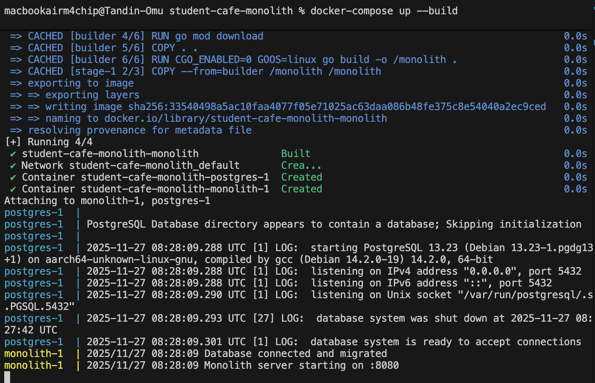
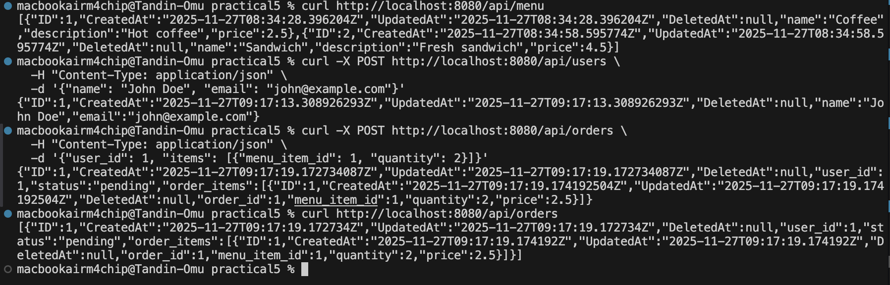
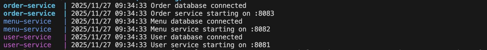
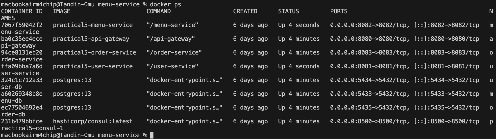
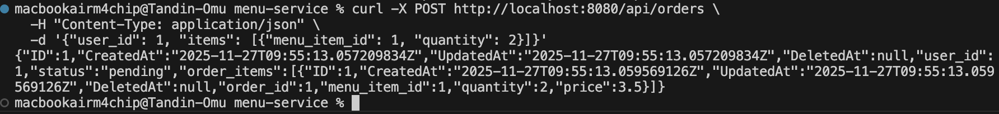
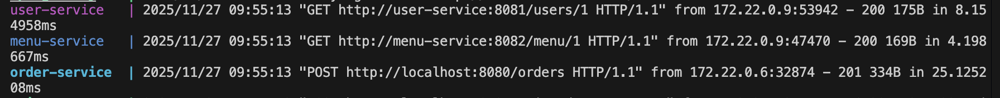
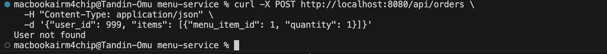
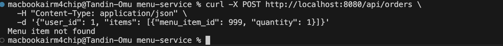
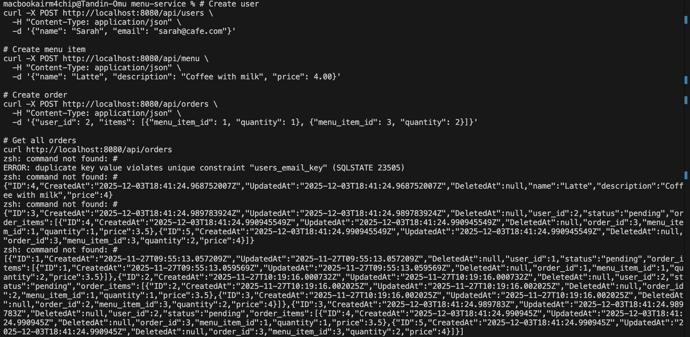

# Practical 5 Report: Refactoring Monolithic Web Server to Microservices


---

## 1. Introduction

This practical demonstrates how to refactor a monolithic Student Cafe application into a microservices architecture. Following the practical instructions, I systematically built a monolithic application and then extracted independent services, implementing inter-service communication, API Gateway routing, and service discovery with Consul.


## 2. Understanding the Architecture

### 2.1 Monolithic Architecture (Before)

The monolithic application has:
- Single codebase with all features
- One PostgreSQL database
- All components tightly coupled
- Runs on port 8080

### 2.2 Microservices Architecture (After)

The refactored system consists of:

```
API Gateway (8080)
    ↓
    ├── User Service (8081) → User DB (5434)
    ├── Menu Service (8082) → Menu DB (5433)
    └── Order Service (8083) → Order DB (5435)

Consul (8500) - Service Discovery
```

### 2.3 Service Responsibilities

| Service | Port | Database | Purpose |
|---------|------|----------|---------|
| User Service | 8081 | user_db | Manages customer accounts |
| Menu Service | 8082 | menu_db | Manages food menu catalog |
| Order Service | 8083 | order_db | Processes customer orders |
| API Gateway | 8080 | - | Routes requests to services |

**Why this split?**
- **User Service:** Independent user data, scales with registrations
- **Menu Service:** Read-heavy, can scale independently for browsing traffic
- **Order Service:** Orchestrates orders, calls user and menu services

---

## 3. Testing the Monolith

### 3.1 Building and Starting the Monolith

Following Part 2 of the practical, the monolithic application is with the following structure:
- `models/` - User, MenuItem, Order, OrderItem models
- `handlers/` - HTTP handlers for each entity
- `database/` - PostgreSQL connection with GORM
- `main.go` - HTTP server with Chi router

Started the monolith:
```bash
cd student-cafe-monolith
docker-compose up --build
```


### 3.2 Creating Test Data



### 3.3 Monolith Observations

---

## 4. Testing the Microservices

### 4.1 Extracting Services from Monolith

Following Parts 3-5 of the practical, I systematically extracted three services:

**Part 3 - Menu Service (First extraction):**
- Created separate `menu-service/` directory
- Extracted MenuItem model and handlers
- Set up dedicated `menu_db` database
- Runs on port 8082

**Part 4 - User Service:**
- Created `user-service/` directory
- Extracted User model and handlers
- Set up `user_db` database
- Runs on port 8081

**Part 5 - Order Service (Most complex):**
- Created `order-service/` directory
- Implemented inter-service communication to user and menu services
- Set up `order_db` database
- Runs on port 8083

**Part 6 - API Gateway:**
- Created `api-gateway/` for centralized routing
- Implemented reverse proxy to all services
- Single entry point on port 8080

**Part 7 - Consul Integration:**
- Added Consul service registry
- Implemented service registration in each service
- Updated gateway for dynamic service discovery

### 4.2 Starting All Services

From the root PRACTICAL5 directory:

```bash
docker-compose up --build
```





### 4.3 Testing Individual Services

After building each service following the practical instructions, I tested them independently:

**Test User Service directly (port 8081):**
```bash
curl -X POST http://localhost:8081/users \
  -H "Content-Type: application/json" \
  -d '{"name": "Alice", "email": "alice@example.com"}'
```


**Test Menu Service directly (port 8082):**
```bash
curl -X POST http://localhost:8082/menu \
  -H "Content-Type: application/json" \
  -d '{"name": "Tea", "description": "Hot tea", "price": 1.50}'

curl http://localhost:8082/menu
```


**Key Observation:** Each service works independently with its own database.

---

## 5. Testing Through API Gateway

### 5.1 API Gateway Routing

All requests now go through port 8080, and the gateway routes them:
- `/api/users/*` → user-service:8081
- `/api/menu/*` → menu-service:8082
- `/api/orders/*` → order-service:8083

### 5.2 Creating Data Through Gateway


---

## 6. Testing Inter-Service Communication

### 6.1 How Order Service Works

When creating an order, the order-service:
1. Receives request with `user_id` and `menu_item_id`
2. Calls user-service to validate user exists
3. Calls menu-service to get menu item details and price
4. Creates order in its own database

This is **inter-service communication** - services talk via HTTP APIs.

### 6.2 Creating an Order

```bash
curl -X POST http://localhost:8080/api/orders \
  -H "Content-Type: application/json" \
  -d '{"user_id": 1, "items": [{"menu_item_id": 1, "quantity": 2}]}'
```






### 6.3 Testing Validation

**Test with invalid user ID:**
```bash
curl -X POST http://localhost:8080/api/orders \
  -H "Content-Type: application/json" \
  -d '{"user_id": 999, "items": [{"menu_item_id": 1, "quantity": 1}]}'
```

**Expected:** Error message "User not found"



**Test with invalid menu item:**
```bash
curl -X POST http://localhost:8080/api/orders \
  -H "Content-Type: application/json" \
  -d '{"user_id": 1, "items": [{"menu_item_id": 999, "quantity": 1}]}'
```

**Expected:** Error message "Menu item not found"



**What this shows:** Order service doesn't have direct database access to users or menu. It validates by calling other services' APIs.

---

## 7. Testing Service Discovery with Consul

### 7.1 Accessing Consul UI

Open in browser:
```
http://localhost:8500
```


### 7.2 How Consul Works

1. **Service Registration:** Each service registers itself when it starts
2. **Health Checks:** Consul pings `/health` endpoint every 10 seconds
3. **Service Discovery:** API Gateway asks Consul "Where is user-service?"
4. **Dynamic Routing:** Gateway gets the service address and forwards request

---

## 8. Complete End-to-End Test

### 8.1 Full Order Workflow

**Step 1: Create menu items**
```bash
curl -X POST http://localhost:8080/api/menu \
  -H "Content-Type: application/json" \
  -d '{"name": "Coffee", "description": "Hot coffee", "price": 2.50}'

curl -X POST http://localhost:8080/api/menu \
  -H "Content-Type: application/json" \
  -d '{"name": "Muffin", "description": "Blueberry muffin", "price": 3.00}'
```

**Step 2: Create customer**
```bash
curl -X POST http://localhost:8080/api/users \
  -H "Content-Type: application/json" \
  -d '{"name": "Sarah", "email": "sarah@cafe.com"}'
```

**Step 3: Place order with multiple items**
```bash
curl -X POST http://localhost:8080/api/orders \
  -H "Content-Type: application/json" \
  -d '{
    "user_id": 1, 
    "items": [
      {"menu_item_id": 1, "quantity": 2},
      {"menu_item_id": 2, "quantity": 1}
    ]
  }'
```

**Step 4: View all orders**
```bash
curl http://localhost:8080/api/orders
```


---

## 9. Observations and Analysis

### 9.1 Database Per Service Pattern

**What I observed:**
- Each service has its own PostgreSQL database
- User data in `user_db`, menu in `menu_db`, orders in `order_db`
- Order service stores `user_id` and `menu_item_id` as references (not foreign keys)

**Benefits:**
-  Services are truly independent
-  Can change user_db schema without affecting menu service
-  Each database can be scaled separately

**Drawbacks:**
- No database foreign keys to enforce relationships
- Can't do joins across services
- Order service must validate via API calls (slower)

### 9.2 Inter-Service Communication

**HTTP REST was used for communication:**

```go
// Order service calling user service
http.Get("http://user-service:8081/users/1")

// Order service calling menu service
http.Get("http://menu-service:8082/menu/1")
```

### 9.3 Service Discovery Benefits

**Without Consul (hardcoded URLs):**
```go
userServiceURL := "http://user-service:8081"  // What if port changes?
```

**With Consul:**
```go
// Gateway asks Consul for service location
serviceURL := discoverService("user-service")  // Dynamic!
```

**Benefits I observed:**
-  Services automatically discovered when they start
- Unhealthy services automatically removed
-  Can run multiple instances of same service (load balancing)
-  Port changes don't require code updates

---

## 10. Challenges Encountered

### 10.1 Challenge: Go Module Checksum Error

**Problem:**
```
SECURITY ERROR: go.sum contains incorrect checksums
```

**Solution:**
```bash
cd user-service
rm go.sum
go mod tidy
```

Repeated for each service. This regenerated correct checksums.

### 10.2 Challenge: Services Couldn't Connect

**Problem:** Order service couldn't reach user-service - connection timeout.

**Cause:** Services need to be on the same Docker network.

**Solution:** Docker Compose automatically creates a network. Service names (like `user-service`) become DNS hostnames within that network.

### 10.3 Challenge: Database Connection Refused

**Problem:** Service crashed with "connection refused" to database.

**Solution:** Used `depends_on` in docker-compose.yml to ensure database starts first:
```yaml
user-service:
  depends_on:
    - user-db
```

### 10.4 Challenge: Port Already in Use

**Problem:** Multiple databases tried to use port 5432.

**Solution:** Mapped each database to different host port:
```yaml
user-db:
  ports:
    - "5434:5432"  # Host:Container
menu-db:
  ports:
    - "5433:5432"
```

---

## 11. Comparison: Monolith vs Microservices

### 11.1 What Works Better in Monolith

 **Simpler to develop** - one codebase, one database  
 **Easier to test** - everything runs locally  
 **Faster responses** - no network calls between components  
 **Database transactions** - can use ACID transactions  
 **Easier debugging** - all code in one place  

### 11.2 What Works Better in Microservices

 **Independent scaling** - can scale menu service separately during high traffic  
 **Independent deployment** - update order service without redeploying menu  
 **Team independence** - different teams can work on different services  
 **Fault isolation** - if menu service fails, users can still work  
 **Technology flexibility** - each service can use different language/database  

### 11.3 The Trade-offs

| Aspect | Monolith | Microservices |
|--------|----------|---------------|
| Complexity | Low | High |
| Performance | Fast (in-memory) | Slower (network calls) |
| Scaling | Scale entire app | Scale individual services |
| Testing | Easy | Hard (need all services) |
| Deployment | Simple | Complex orchestration |
| Data consistency | Easy (ACID) | Hard (eventual consistency) |

**When to use Monolith:**
- Small team (< 10 developers)
- Simple application
- Tight coupling unavoidable
- Early stage with changing requirements

**When to use Microservices:**
- Large team (need independence)
- Need to scale specific features
- Different features have different load patterns
- Want fault isolation

---

## 13. Reflection

### 13.1 What I Learned

Building this system from scratch taught me that **microservices are not inherently better than monoliths** - they're a tool for specific problems. 

**The Implementation Process:**
I started by building the monolith in Part 2, which gave me a working baseline to compare against. Then I systematically extracted services:
- Menu service first (Part 3) - simplest with no dependencies
- User service next (Part 4) - similar pattern to menu
- Order service last (Part 5) - most complex due to inter-service dependencies

Each extraction required:
1. Creating new service directory structure
2. Copying and modifying models/handlers
3. Setting up dedicated database
4. Implementing HTTP server
5. Creating Dockerfile and updating docker-compose.yml

This incremental approach was much safer than trying to build everything at once.

The Student Cafe application is actually simple enough that a monolith would work fine for a small team. However, microservices become valuable when:
- Different features have different scaling needs (menu browsing vs order processing)
- Multiple teams need to work independently
- Some services need higher availability than others
- Different parts of the system change at different rates

### 13.2 Most Important Insight

**The database-per-service pattern** was the most challenging concept. Losing foreign key constraints and transactions feels wrong at first, but it's necessary for true service independence. The order service storing `user_id` as just a number (not a foreign key) means we must validate via API calls - slower, but decoupled.

### 13.3 Real-World Applicability

Companies like Netflix, Amazon, and Uber use microservices, but they:
- Started with monoliths
- Gradually extracted services as they grew
- Built extensive tooling for observability and debugging
- Have teams dedicated to platform/infrastructure

For a startup or small project, starting with a monolith and extracting services later (like this practical demonstrates) is the recommended approach.

---

## 14. Conclusion

This practical successfully demonstrated the systematic refactoring of a monolithic application into microservices. Following the practical instructions across Parts 2-7, I:

 Built a monolithic Student Cafe application with all features in one codebase  
 Extracted menu-service with its own database (Part 3)  
 Extracted user-service independently (Part 4)  
 Built order-service with inter-service communication (Part 5)  
 Implemented API Gateway for unified routing (Part 6)  
 Integrated Consul for dynamic service discovery (Part 7)  

**Implementation Highlights:**
- Created 5 separate Go applications (monolith + 4 microservices)
- Set up 4 independent PostgreSQL databases
- Implemented HTTP-based inter-service communication
- Configured Docker Compose to orchestrate all services
- Added service registration and health checking with Consul

**Key takeaway:** Microservices add complexity but enable independent scaling, deployment, and development. The incremental extraction approach (menu → user → order) was much safer than a "big bang" rewrite. The decision to split should be based on actual needs (team size, scaling requirements, fault isolation) rather than following trends.

**Next steps:**
- Migrate to gRPC for more efficient communication (Practical 1)
- Deploy to Kubernetes for production orchestration (Practical 4)
- Add circuit breakers, caching, and monitoring

---

## Appendix: Quick Reference

### Service Ports
- API Gateway: 8080
- User Service: 8081 (DB on 5434)
- Menu Service: 8082 (DB on 5433)
- Order Service: 8083 (DB on 5435)
- Consul: 8500

### Common Commands
```bash
# Start all services
docker-compose up --build

# Stop all services
docker-compose down

# View specific service logs
docker-compose logs -f order-service

# Check running containers
docker ps

# Restart specific service
docker-compose restart menu-service
```

### API Endpoints
```bash
# Users
POST /api/users          # Create user
GET  /api/users/{id}     # Get user

# Menu
GET  /api/menu           # List menu items
POST /api/menu           # Create menu item

# Orders
POST /api/orders         # Create order
GET  /api/orders         # List orders
```

